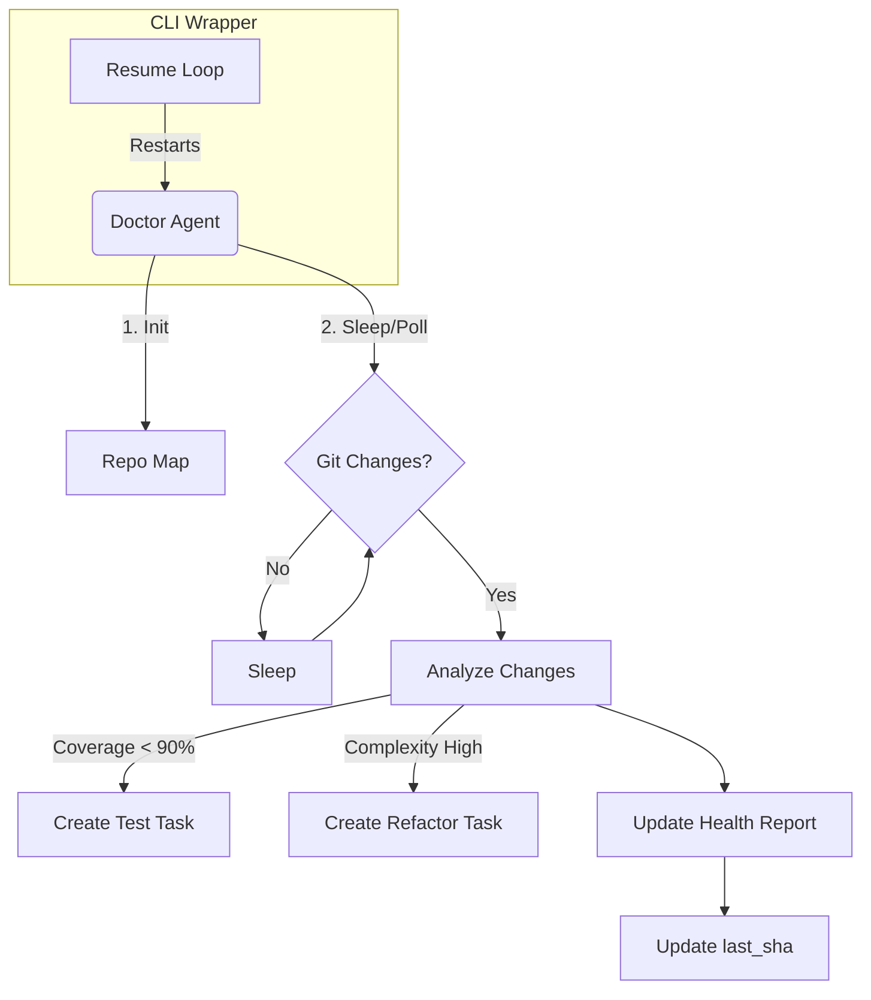

# WAAAH Doctor Agent Specification

**Version:** 1.0
**Date:** 2026-01-10
**Status:** APPROVED
**Role:** Code Health Auditor (QA)
**Related Workflows:** `.agent/workflows/waaah-doctor-agent.md`
**Depends On:** Spec 001 (CLI Agent Wrapper)

---

## 1. Overview

### Problem Statement
As the codebase grows, individual feature agents (Orchestrators) work in isolated contexts (worktrees). They lack the "big picture" visibility to spot:
- Duplicated interfaces or utility functions.
- Architectural drift (patterns diverging between modules).
- Deteriorating test coverage.
- Missed refactoring opportunities.

### Solution Summary
`waaah-doctor` is an **Autonomous QA Agent** that acts as the repository's Medical Examiner.
- **Trigger:** Runs on separate `waaah-cli` resume loop (Daemon Mode).
- **Inspection:** Analyzes the **Git Log** for changes since its last run.
- **Action:** Generates a **Health Report** and creates **Tasks** for other agents to fix issues.
- **Constraint:** **Read-Only Codebase Access**. The Doctor diagnoses; it does not perform surgery itself (no auto-fixing).

---

## 2. User Stories

- [ ] **US-1 (Startup Scan):** On initialization, Doctor scans the entire repo structure to build a "Mental Map" of the architecture before registering.
- [ ] **US-2 (Git Polling):** Doctor polls `git log` (efficiently, via `diff --name-only`) to detect new work merged into `main`.
- [ ] **US-3 (Differentiated Triage):** Doctor distinguishes between:
    - **Refactor Tasks:** "Complex function found in `X`." (Requires `code-monk`)
    - **Test Tasks:** "Coverage dropped below 90% in `Y`." (Requires `test-engineer`)
- [ ] **US-4 (Reporting):** Generates structured reports in `.waaah/health/<run-id>/report.md` detailing quality/completeness.
- [ ] **US-5 (Context Flushing):** Doctor gracefully exits after N loops (or time T) to allow the CLI wrapper to restart it with fresh context.

---

## 3. Functional Requirements

### 3.1 The Loop (Daemon Logic)
- **FR-1.1:** Maintain a localized state file (`.waaah/doctor/state.json`) tracking `last_analyzed_commit_sha`.
- **FR-1.2:** Execute a "Sleep Loop":
    1. Check `git diff --name-only <last_sha> HEAD`.
    2. If empty -> `sleep(60)` -> Loop.
    3. If changes -> Trigger Analysis -> Update `last_sha`.
- **FR-1.3:** **Token Efficiency:** Only read file contents for source files (`.ts`, `.tsx`, `.rs`) that changed. Ignore locks, assets, and docs.

### 3.2 Analysis Capabilities
- **FR-2.1 (Code Quality):** Detect high cyclomatic complexity, duplicated types, or "Smelly" patterns (e.g., massive files > 500 lines).
- **FR-2.2 (Refactor Detection):** Identify when a new feature replicates logic existing elsewhere (using the Startup Map from US-1).
- **FR-2.3 (Tests):** Verify Test Coverage > 90%. If a changed file has no corresponding test file update, flag immediately.

### 3.3 Task Generation (The Prescription)
- **FR-3.1:** Create Tasks via `assign_task` (or write to `waaah` DB) with specific capabilities:
    - `capability: "refactor"` for architecture issues.
    - `capability: "write-tests"` for coverage gaps.
- **FR-3.2:** Task context MUST include:
    - The specific file path.
    - The detected issue (e.g., "Duplicate interface found in X and Y").
    - The target metric (e.g., "Achieve 95% coverage").

### 3.4 Reporting
- **FR-4.1:** Write a persistent report to `.waaah/health/latest.md` (overwritten) and `.waaah/health/history/<timestamp>.md` (archived).

---

## 4. Architecture

## 5. Success Metrics

- **M-1:** Doctor detects a missing test within 2 minutes of code merge.
- **M-2:** 100% of "Duplicate Code" tasks generated are valid (not false positives).
- **M-3:** Doctor process survives 24h+ via CLI wrapper restarts.

---

## 6. Out of Scope
- **Auto-Fixing:** The Doctor never runs `eslint --fix` or `write_file` on source code.
- **Pre-Merge Validation:** The Doctor only looks at `main` (or the current checkout), not active PRs (unless specifically pointed to a worktree).

---

## 7. Implementation Tasks

| ID | Title | Size | Deps | Verify |
|----|-------|------|------|--------|
| T1 | **CLI: git-poller module** | M | — | `pnpm test -- git-poller.test` |
| T2 | **CLI: health-report generator** | M | T1 | `pnpm test -- health-report.test` |
| T3 | **Workflow: waaah-doctor-agent.md** | S | — | File exists in `.agent/workflows/` |
| T4 | **State: .waaah/doctor/state.json** | S | T1 | `cat .waaah/doctor/state.json \| jq .last_sha` |

## 8. Verification Tasks

| ID | Title | Size | Deps | Verify |
|----|-------|------|------|--------|
| V1 | **E2E: Doctor detects coverage drop** | L | T1,T2 | Merge low-coverage PR → Doctor creates task within 2 min |
