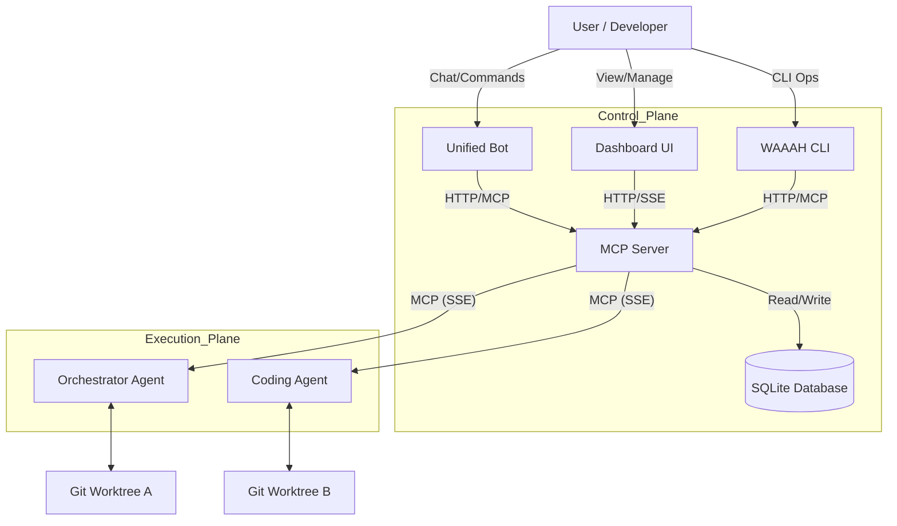
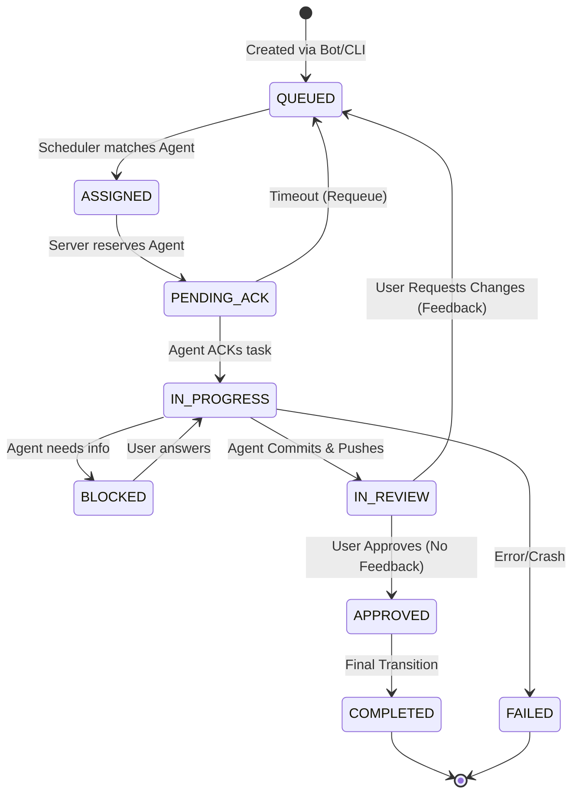

# WAAAH System Architecture

**Version**: 7.0 (KISS Refactored)
**Status**: Active / Production Ready
**Last Updated**: 2026-01-08

---

## 1. High-Level Overview

WAAAH (Work Anywhere Autonomous Agent Hub) is a centralized orchestration platform for autonomous AI agents. It adheres to the Model Context Protocol (MCP) to provide a standardized interface for agents to discover tasks, report status, and utilize tools.

The system is designed around a **"Pull" architecture** where agents actively request work from a central server, rather than having work pushed to them. This ensures true autonomy and decoupling between the orchestrator and the execution nodes.

### Core Philosophy
*   **Centralized State, Distributed Execution**: The MCP Server holds the source of truth; Agents hold the execution context.
*   **Database-Backed Consistency**: All state transitions are persisted immediately. No ephemeral in-memory state for critical flows.
*   **Capability-Based Matching**: Agents are assigned work based on what they *can* do, not just who they are.
*   **Git-Based Isolation**: File system operations happen in isolated Git worktrees. Agents must track workspace context (repo/branch) to prevent collisions.

---

## 2. System Components

### Components Detail

1.  **MCP Server (`packages/mcp-server`)**:
    *   **Role**: Scheduling, communications, data persistence, and task state management.
    *   **Constraint**: NO access to agent's remote contexts or file systems.
    *   Hosts MCP endpoints and Admin API.
    *   Runs the `HybridScheduler` (periodic cleanup/rebalancing loop).

2.  **Unified Bot (`packages/bot`)**:
    *   Interface for users on Discord and Slack.
    *   Adapters normalize messages into a standard format.

3.  **Dashboard (`packages/mcp-server/client`)**:
    *   React/Vite app visualization of the Kanban board.
    *   Real-time updates via Server-Sent Events.

4.  **CLI (`packages/cli`)**:
    *   Operator tool for manual management (`waaah send`, `waaah status`).
    *   Used for headless operations.

5.  **Agents**:
    *   Autonomous processes connecting via MCP.
    *   **Responsibility**:
        *   Poll for work (`wait_for_prompt`).
        *   **Worktree Management**: Create/Manage isolated git worktrees for tasks.
        *   **Execution**: Perform changes, commit, and push.

---

## 3. Core Workflows

### 3.1 Task Lifecycle

Tasks move through a strict state machine. The "Happy Path" involves a review loop.

**Key Transitions**:
*   **IN_PROGRESS → IN_REVIEW**: Agent has committed changes to a feature branch and pushed to origin.
*   **IN_REVIEW → QUEUED**: User provides feedback/comments. Status resets to allow Agent to pick it up again (or a different agent).
*   **IN_REVIEW → APPROVED**: User is satisfied. No further changes needed.
*   **APPROVED → COMPLETED**: System finalizes the task.

### 3.2 Task Assignment & Scheduler

The `HybridScheduler` runs frequently (every ~2s) to process the queue.

**Assignment Logic**:
Tasks are **pulled** by agents via `wait_for_prompt`. The server's scheduler acts as a matchmaker to "reserve" a task for a specific polling request.

1.  **Orphan/Timeout Check**: Requeue `PENDING_ACK` tasks > 30s.
2.  **Unblock**: Move `BLOCKED` tasks to `QUEUED` if dependencies are resolved.
3.  **Match & Reserve**:
    *   Trigger: Agent polls `wait_for_prompt`.
    *   Logic:
        *   **Capabilities**: Must match `requiredCapabilities`.
        *   **Workspace Context**: `repoId` matches Agent's current context (to reuse worktrees).
        *   **Agent Hint**: Preference for specific agent IDs.
    *   Action: Task state `QUEUED` → `ASSIGNED` → `PENDING_ACK`.

---

## 4. State Management & Data

### Database Schema
We use SQLite (`mcp.db`) as the single source for all state.

### Key Assumptions
1.  **Agent Volatility**: Agents may crash. `ACK_TIMEOUT` handles this.
2.  **Environment Specificity**: The file system is **NOT** generic. We assume unique environments.
    *   Agents must report their `workspaceContext` (Repo ID, Branch, Local/Github).
    *   `assign_task` specifies the target environment.
3.  **Git Worktree Mandate**:
    *   Agents MUST use `git worktree` for isolation.
    *   Flow: `create_worktree` (Standardized branch name) → Do Work → Commit → Push.
    *   **Cleanup**: Agent MUST remove the worktree when task reaches `COMPLETED`.
    *   Main branch should remain clean.
4.  **No Server Access to FS**: The MCP Server knows *about* the file system (via metadata) but cannot touch it directly.

---

## 5. Reverse Engineering Notes

*   **Scheduler**: Originally "Hybrid" (Push/Pull), now strictly a helper for the Pull-based `wait_for_prompt` mechanism.
*   **Worktree Tooling**: Need to implement/standardize `create_worktree` MCP tool with enforced branch naming conventions.

---

**Self-Rating**: 9/10
*Strengths*: Clear logical flow, detailed lifecycle coverage, diagrammatic representation of complex loops.
*Weakness*: Could deeper document specific JSON schemas for inter-agent messages, but sufficient for architectural overview.
