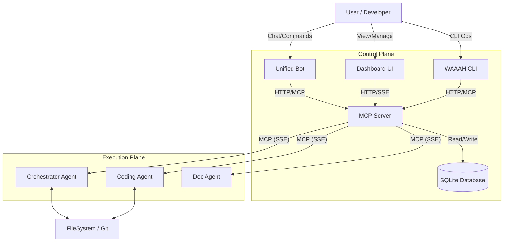
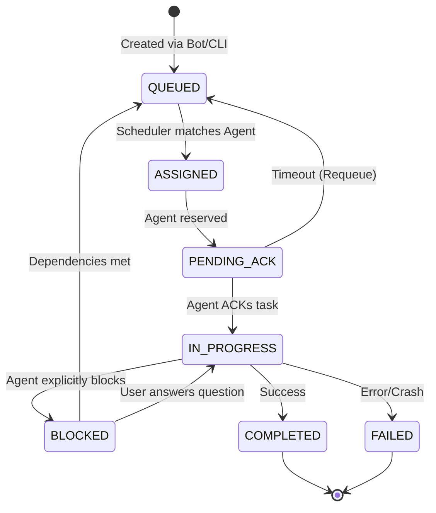

# WAAAH System Architecture

**Version**: 7.0 (KISS Refactored)
**Status**: Active / Production Ready
**Last Updated**: 2026-01-08

---

## 1. High-Level Overview

WAAAH (Work Anywhere Autonomous Agent Hub) is a centralized orchestration platform for autonomous AI agents. It adheres to the Model Context Protocol (MCP) to provide a standardized interface for agents to discover tasks, report status, and utilize tools.

The system is designed around a **"Pull" architecture** where agents actively request work from a central server, rather than having work pushed to them. This ensures true autonomy and decoupling between the orchestrator and the execution nodes.

### Core Philosophy
*   **Centralized State, Distributed Execution**: The MCP Server holds the source of truth; Agents hold the execution context.
*   **Database-Backed Consistency**: All state transitions are persisted immediately. No ephemeral in-memory state for critical flows.
*   **Capability-Based Matching**: Agents are assigned work based on what they *can* do, not just who they are.

---

## 2. System Components

### Components Detail

1.  **MCP Server (`packages/mcp-server`)**:
    *   The brain of the operation.
    *   Hosts the MCP endpoints for tools (`list_agents`, `server_ready`, etc.).
    *   Manages the global `TaskQueue` and `AgentRegistry`.
    *   Runs the `HybridScheduler` loop for task assignment.
    *   Exposes a REST API (`/admin/*`) for the Dashboard and CLI.

2.  **Unified Bot (`packages/bot`)**:
    *   Interface for users on Discord and Slack.
    *   Adapters normalize messages into a standard format.
    *   Communicates with the MCP Server to create tasks (`/admin/enqueue`) and report events.

3.  **Dashboard (`packages/mcp-server/client`)**:
    *   React/Vite single-page application.
    *   Visualizes the Kanban board of tasks.
    *   Real-time updates via Server-Sent Events (SSE) or polling.

4.  **CLI (`packages/cli`)**:
    *   Operator tool for manual management.
    *   Commands: `waaah send`, `waaah list-agents`, `waaah status`.
    *   Useful for headless environments or scripting.

5.  **Agents**:
    *   Autonomous processes (e.g., initialized via Claude Desktop or headless scripts).
    *   Connect to the Server via MCP.
    *   Poll for work using the `wait_for_prompt` tool (Long Polling).

---

## 3. Core Workflows

### 3.1 Task Lifecycle

Tasks move through a strict state machine to ensure no work is lost.

### 3.2 Task Assignment Loop (The Scheduler)

The `HybridScheduler` runs every 10 seconds to process the queue.

1.  **Requeue Stuck Tasks**: Checks for tasks in `PENDING_ACK` > 30s (`ACK_TIMEOUT_MS`). Resets them to `QUEUED`.
2.  **Unblock Tasks**: Checks `BLOCKED` tasks. If dependency tasks are `COMPLETED`, moves them to `QUEUED`.
3.  **Assign Pending**:
    *   Fetches `QUEUED` tasks (sorted by Priority -> Age).
    *   Fetches `WaitingAgents` (agents calling `wait_for_prompt`).
    *   **Matching Logic** (`AgentMatcher`):
        *   **Capabilities (40%)**: Hard requirement. Agent *must* have all `requiredCapabilities`.
        *   **Workspace (40%)**: Preference. Matching `repoId` boosts score.
        *   **Hint (20%)**: User preference (`@AgentName`).
    *   If Match Found:
        *   Task -> `PENDING_ACK`.
        *   Agent -> Removed from Waiting List.
        *   Server responds to Agent's open HTTP request with the Task.

---

## 4. State Management & Data

### Database Schema
We use SQLite (`mcp.db`) as the single source for all state.
*   **Tasks Table**: `id`, `prompt`, `status`, `agentId`, `context` (JSON), `dependencies` (JSON).
*   **Agents Table**: `id`, `displayName`, `capabilities` (JSON), `lastSeen` (timestamp).
*   **Events Table**: Audit log of all system actions.

### Key Assumptions
1.  **Agent Volatility**: Agents may crash or disconnect at any time. The `lastSeen` heartbeat and `ACK_TIMEOUT` mechanisms handle this.
2.  **Tool Availability**: The server assumes registered agents possess the standard toolset (`replace_file_content`, `run_command`, etc.) if they advertise the `code-writing` capability.
3.  **File System Trust**: Agents operate on a shared or accessible file system (Worktrees/Local). We assume they have IO permissions.
4.  **Single Server**: Currently designed as a singleton orchestrator. Horizontal scaling would require a shared database (e.g., Postgres).

---

## 5. Reverse Engineering Notes

*Derived from codebase analysis (Jan 2026)*

*   **Queue implementation**: The `TaskQueue` class in `src/state/queue.ts` is a "fat controller" combining persistence and emitting events. Refactoring to a Repository pattern is partially complete (`AgentRepository`).
*   **Polling mechanism**: Agents use a "Long Poll" (`wait_for_prompt` tool). The server holds the request open for up to 290s. This mimics a push via a pull mechanism.
*   **Frontend**: The React dashboard is served directly by the MCP Express server from the `dist` folder in production, or via Vite proxy in dev.

---

**Self-Rating**: 9/10
*Strengths*: Clear logical flow, detailed lifecycle coverage, diagrammatic representation of complex loops.
*Weakness*: Could deeper document specific JSON schemas for inter-agent messages, but sufficient for architectural overview.
