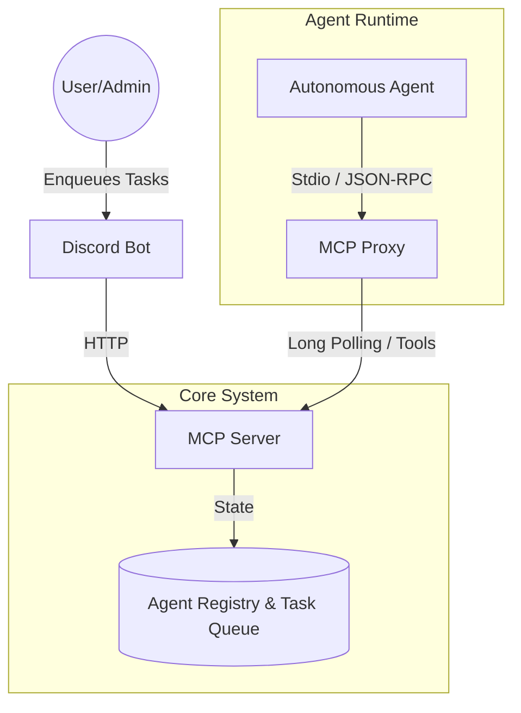

# WAAAH: Web-Age Autonomous Agent Hub

WAAAH is a system for orchestrating autonomous AI agents to collaborate on complex software engineering tasks. It utilizes the Model Context Protocol (MCP) to establish a communication layer between an orchestration server, a proxy, and various client interfaces (CLI, Discord, VS Code).

## 🚀 Architecture



## 📦 Packages

This is a monorepo managed with `pnpm workspaces`.

- **[`packages/mcp-server`](packages/mcp-server)**: The central orchestration server. Handles agent registration, task queuing, and communication.
- **[`packages/mcp-proxy`](packages/mcp-proxy)**: A bridge that runs locally with the agent, exposing MCP tools via `stdio` and communicating with the server via HTTP.
- **[`packages/discord-bot`](packages/discord-bot)**: A Discord bot interface for users to easy enqueue tasks and monitor agent progress.
- **[`packages/types`](packages/types)**: Shared TypeScript definitions and schemas.

## 🛠️ Prerequisites

- **Node.js**: v18+
- **PNPM**: All dependencies are managed via pnpm.

## 🏃 Quick Start

1.  **Install & Build**
    ```bash
    pnpm install && pnpm build
    ```

2.  **Start the Server**
    ```bash
    pnpm server
    ```

3.  **Send a Task via CLI**
    ```bash
    pnpm cli send fullstack-1 "Create a login page"
    pnpm cli list-agents
    ```

---

## 🤖 Antigravity Integration

### Step 1: Configure MCP

Add to `~/.gemini/settings.json`:

```json
{
  "mcpServers": {
    "waaah": {
      "command": "node",
      "args": ["/path/to/WAAAH/packages/mcp-proxy/dist/index.js"],
      "env": {
        "WAAAH_SERVER_URL": "http://localhost:3000",
        "AGENT_ID": "fullstack-1",
        "AGENT_ROLE": "full-stack-engineer"
      }
    }
  }
}
```

### Step 2: Initialize Agent

In Antigravity, use one of these workflows:

| Command | Role |
|---------|------|
| `/waaah-fullstack` | Full Stack Engineer |
| `/waaah-pm` | Project Manager |
| `/waaah-testeng` | Test Engineer |

This loads the system prompt and starts the autonomous agent loop.

### Step 3: Send Tasks

From another terminal:
```bash
pnpm cli send fullstack-1 "Implement user authentication"
```

The agent will receive the task via `wait_for_prompt` and execute autonomously.

---

## 📦 Available Scripts

| Script | Description |
|--------|-------------|
| `pnpm server` | Start MCP orchestration server |
| `pnpm cli <command>` | CLI for local testing |
| `pnpm bot` | Start Discord bot |
| `pnpm proxy` | Start MCP proxy instance |
| `pnpm build` | Build all packages |

---

## 📂 Packages

- **[`packages/mcp-server`](packages/mcp-server)**: Central orchestration server
- **[`packages/mcp-proxy`](packages/mcp-proxy)**: Stdio↔HTTP bridge for agents
- **[`packages/cli`](packages/cli)**: Command-line interface
- **[`packages/discord-bot`](packages/discord-bot)**: Discord integration
- **[`packages/types`](packages/types)**: Shared TypeScript definitions

## 🤝 Contributing

See [CONTRIBUTING.md](./CONTRIBUTING.md) for guidelines.

## 📄 License

MIT

