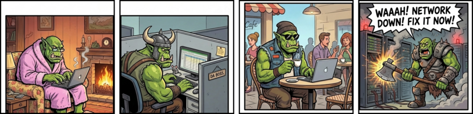
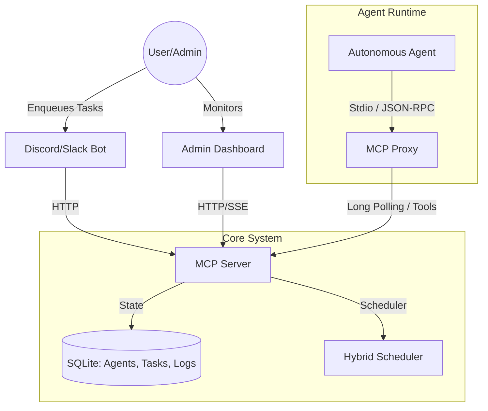

# WAAAH: Work Anywhere Autonomous Agent Hub

> [!WARNING]
> **🧪 Harebrained Experiment**: This project is dubious at best. It was born when the author wondered, "Can I still work while on the toilet?" APIs and features may change without notice.

[](https://github.com/davidtai/WAAAH/actions/workflows/ci.yml)

<p align="center">
  
</p>

WAAAH is an orchestration system for specialized AI agents. It uses the Model Context Protocol (MCP) with **blocking tool calls** to inject orchestration capabilities into **any AI workspace**—even those that are strictly sandboxed or network-restricted—by tunnelling through standard tool interfaces.



## 📑 Index

- [Key Features](#-key-features)
- [WAAAH Anywhere](#-waaah-anywhere) (Clients & Use Cases)
- [Admin Dashboard](#-admin-dashboard)
- [WAAAH vs Single-Agent AI](#-waaah-vs-single-agent-ai)
- [Prerequisites](#️-prerequisites)
- [Starting The WAAAH](#-starting-the-waaah)
- [Configuration](#️-configuration)
- [Connecting Agents](#-connecting-agents)
- [Production Deployment](#-production-deployment)
- [Architecture](#️-architecture)
- [Packages](#-packages)
- [Available Scripts](#-available-scripts)
- [Troubleshooting](#-troubleshooting)
- [Contributing](#-contributing)

## ✨ Key Features

- **Multi-Agent Orchestration**: Coordinate specialized agents (PM, Full Stack, Test Engineer) via a central MCP server.
- **Admin Dashboard**: Real-time web UI for monitoring agents, tasks, and activity logs with a 3-way theme engine (WAAAH/LIGHT/DARK).
- **Hybrid Task Scheduler**: Background scheduler that requeues stuck tasks, proactively assigns high-priority work, and recovers orphaned tasks.
- **Persistent State**: SQLite-backed registry for agents, tasks, and security events.
- **Bot Integration**: Unified Discord/Slack bot for task submission and team monitoring.

---

> [!NOTE]  
> **Command Syntax**: Use **`@WAAAH`** mentions for Discord/Slack bot interactions (e.g., `@WAAAH status`). Use **`/waaah-*`** slash commands ONLY within your IDE for initializing local agent workflows.

---

## 🌍 WAAAH Anywhere

### Client Interfaces

| Client | Description | Best For |
|--------|-------------|----------|
| **CLI** | Command-line interface for local testing and scripting | Developers, CI/CD pipelines |
| **Admin Dashboard** | Real-time web UI at `/admin` | Monitoring, manual task management |
| **Discord Bot** | Chat-based task submission and team notifications | Distributed teams, async collaboration |
| **Slack Bot** | Enterprise chat integration | Corporate environments |
| **MCP Proxy** | JSON-RPC bridge for AI agents | Autonomous agents (Antigravity, Claude, Cursor) |
| **HTTP API** | RESTful endpoints for custom integrations | Webhooks, custom dashboards, automation |

### Use Cases

#### 🧑‍💻 Solo Developer: Unchained Freedom
You're no longer tethered to your desk. Start a long-running feature implementation from your laptop, then head to the kitchen. Monitor progress, answer clarification questions, and review final PRs from your phone via Discord:
```
@WAAAH status  → View all active agents
@WAAAH @FullStack "Deploy to staging"
```

#### 📉 Token Optimization: Multi-Tenancy
Pool your team's API credits. Connect developers to a shared WAAAH pool where the hybrid scheduler prioritizes urgent tasks while filling gaps with background work. Agents self-evict when out of tokens (manual rejoin required).

#### 🤖 Agent-of-Agents: Swarm Orchestration
Antigravity orchestrates tools internally; WAAAH orchestrates **the orchestrators**. Connect multiple AI instances—same or different repos—to a central manager:
```
Boss (You) → assign_task("backend-agent", "Deploy API")
           → assign_task("mobile-agent", "Update iOS SDK")
           → wait_for_task("task-abc") # Sync point
```
**Heterogeneous Models**: Mix Claude, OpenAI o1, and Gemini—they all speak MCP.

#### 🔄 CI/CD Pipeline Integration
Trigger agents from GitHub Actions or Jenkins:
```bash
curl -X POST https://waaah.example.com/admin/tasks \
  -H "Authorization: Bearer $WAAAH_API_KEY" \
  -d '{"target": "fullstack-1", "prompt": "Fix failing tests"}'
```

#### 🎮 Hackathon Mode
Spin up specialized agents in parallel (each needs its own AI client—multiple VS Code windows or Claude profiles):
1. Start Server: `pnpm serve`
2. Connect agents via MCP config
3. Coordinate via the Dashboard or `@WAAAH` bot

---

## 🎨 Admin Dashboard

Real-time visibility into your WAAAH system:
- **Agents**: Status, eviction controls
- **Tasks**: Active monitoring, history, cancel/retry
- **Activity Feed**: Live event log
- **Themes**: WAAAH (Green), LIGHT, DARK

---

## ⚡ WAAAH vs Single-Agent AI

| Feature | WAAAH | Single Agent |
|---------|-------|-------------------------------|
| **Agents** | Multiple specialized | One per session |
| **Persistence** | SQLite (tasks, agents, logs) | Conversation only |
| **Remote Control** | Chat bots → HTTP | Local only |
| **Task Recovery** | Auto-retry via scheduler | Manual |

**WAAAH**: Team of agents on larger projects. **Single agent**: Interactive pair programming.

---

## 🛠️ Prerequisites

- **Node.js**: v18+
- **PNPM**: All dependencies are managed via pnpm.
- **Docker** (optional): For containerized deployment.

---

## 🚀 Starting The WAAAH

Run the orchestration server and bot for your team:

### Option A: Local Development

1. **Install & Build**
   ```bash
   cp .env.example .env  # Configure your tokens first!
   pnpm install && pnpm build
   ```

2. **Start Services**
   ```bash
   pnpm serve &  # Server in background
   pnpm bot      # Bot in foreground
   ```

3. **Access the Dashboard**
   ```
   http://localhost:3000/admin
   ```

4. **Set Up MCP** — Follow the [Connecting Agents](#-connecting-agents) section to add the WAAAH MCP proxy to your Antigravity config.

5. **Start Your First Delegation (Antigravity)**
   1. Open your project in Antigravity
   2. **Conversation 1**: Run `/waaah-fullstack` → Wait until it says "Waiting for prompt"
   3. **Conversation 2**: Run `/waaah-boss` → Start with:
      ```
      Delegate the creation of this new feature: [your feature description]
      ```
   4. Switch between conversations via the Agent Manager to monitor progress

### First Run
On startup, WAAAH creates `data/waaah.db`, runs migrations, and seeds agents from `agents.yaml`.

---

## ⚙️ Configuration

1. **Verify Environment**: Ensure `.env` is created.
   ```bash
   # Generate a secure API key if needed
   openssl rand -hex 32
   ```

2. **Edit `.env` to set your tokens** — see [`.env.example`](.env.example) for the full list of environment variables.

---

## 🤝 Connecting Agents

Connect your AI agent to a WAAAH server:

1. **Add MCP config** (e.g., `~/.gemini/antigravity/mcp_config.json`):
   ```json
   {
     "mcpServers": {
       "waaah": {
         "command": "npx",
         "args": ["@opensourcewtf/waaah-mcp-proxy"],
         "env": {
           "WAAAH_SERVER_URL": "https://your-waaah-server.com",
           "WAAAH_API_KEY": "your_api_key"
         }
       }
     }
   }
   ```
   *> Or install globally: `npm i -g @opensourcewtf/waaah-mcp-proxy`*

2. **Initialize your agent** with a workflow command:
   | Command | Role |
   |---------|------|
   | `/waaah-fullstack` | Full Stack Engineer (autonomous loop) |
   | `/waaah-pm` | Project Manager (autonomous loop) |
   | `/waaah-tester` | Test Engineer (autonomous loop) |
   | `/waaah-boss` | **Tech Lead** (orchestrator—pair with you) |

3. **Start receiving tasks** — worker agents enter an autonomous loop via `wait_for_prompt`. The Boss stays interactive.

> [!TIP]
> **Copy workflows to your project** for `/waaah-*` commands:
> ```bash
> cp -r /path/to/WAAAH/.agent . && echo ".agent/" >> .gitignore
> ```

**📖 Guides:**
- [Antigravity Setup Guide](docs/ANTIGRAVITY_SETUP.md) - Multi-agent setup with VS Code
- [Full MCP Integration Guide](docs/MCP_INTEGRATION.md) - Claude Desktop, Cursor, OpenAI SDK

---

## 🚀 Production Deployment

1. **Configure Environment**: Set `DOMAIN_NAME` and tokens in `.env`.

2. **Initialize SSL Certificates**:
   ```bash
   chmod +x init-letsencrypt.sh && ./init-letsencrypt.sh
   # (Requires Docker)
   ```

3. **Start Services**:
   ```bash
   docker compose up -d --build
   ```
   - Server: `https://yourdomain.com`
   - Dashboard: `https://yourdomain.com/admin`

---

## 🏗️ Architecture



---

## 📦 Packages

This is a monorepo managed with `pnpm workspaces`.

| Package | Description |
|---------|-------------|
| [`packages/mcp-server`](packages/mcp-server) | Central orchestration server with Admin Dashboard |
| [`packages/mcp-proxy`](packages/mcp-proxy) | Stdio↔HTTP bridge for agents |
| [`packages/bot`](packages/bot) | Unified Discord/Slack bot |
| [`packages/cli`](packages/cli) | Command-line interface for local testing |
| [`packages/types`](packages/types) | Shared TypeScript definitions and Zod schemas |

---

## � Available Scripts

| Script | Description |
|--------|-------------|
| `pnpm serve` | Start MCP orchestration server |
| `pnpm cli <command>` | CLI for local testing |
| `pnpm bot` | Start Discord/Slack bot |
| `pnpm proxy` | Start MCP proxy instance |
| `pnpm build` | Build all packages |
| `pnpm test` | Run all tests |

### Docker Commands

#### Production (with SSL)

| Script | Description |
|--------|-------------|
| `pnpm docker:build` | Build all Docker images |
| `pnpm docker:up` | Start all containers (detached) |
| `pnpm docker:down` | Stop all containers |
| `pnpm docker:logs` | Follow container logs |
| `pnpm docker:restart` | Restart containers (no rebuild) |
| `pnpm docker:reload` | Stop, rebuild, and restart |
| `pnpm docker:ps` | Show container status |

#### Local Development (no SSL)

| Script | Description |
|--------|-------------|
| `pnpm docker:local:up` | Start local stack |
| `pnpm docker:local:down` | Stop local stack |
| `pnpm docker:local:build` | Build containers |
| `pnpm docker:local:logs` | View logs |
| `pnpm docker:local:reload` | Full rebuild and restart |

#### Docker Quick Start (Local)

```bash
# First time setup
cp .env.example .env
# Edit .env with your tokens

# Build and start (local, no SSL)
pnpm docker:local:build
pnpm docker:local:up

# View logs
pnpm docker:local:logs

# After code changes
pnpm docker:local:reload
```

#### Access Points (Local)

| URL | Description |
|-----|-------------|
| `http://localhost:80` | Through nginx proxy |
| `http://localhost:80/admin` | Admin Dashboard |
| `http://localhost:3000` | Direct server access |

---

## ❓ Troubleshooting

| Issue | Solution |
|-------|----------|
| **Port 3000 In Use** | Set `PORT=3001` in `.env` or kill the process: `lsof -ti:3000 | xargs kill -9` |
| **Agent Not Appearing** | Ensure your agent proxy is running and `WAAAH_API_KEY` matches the server. |
| **Bot "Thinking..."** | Check `pnpm bot` logs for errors. Verify `DISCORD_TOKEN` relates to the correct server. |
| **Schema Errors** | Delete `data/waaah.db` to reset state (Warning: clears all history). |

### 💡 Model Compatibility Tips

> [!NOTE]
> WAAAH was primarily developed and tested with **Gemini** models (via Antigravity). Other models may require workflow adjustments.

| Model | Compatibility | Notes |
|-------|--------------|-------|
| **Gemini** | ✅ Excellent | Primary dev/test model. Follows `wait_for_prompt` loops reliably. |
| **Claude** | ⚠️ Good | Tends to escape from wait loops. May need explicit "loop forever" instructions. |
| **GPT-4** | ⚠️ Untested | Should work via OpenAI Agents SDK, but not battle-tested. |

**Claude Users:** Add explicit loop reinforcement to your system prompt:
```
CRITICAL: After every send_response, you MUST call wait_for_prompt again. 
Never end the conversation. Loop forever until the user terminates.
```

## ⚠️ Known Limitations

> [!CAUTION]
> **Discord Bot Testing**: The Discord adapter has limited automated test coverage. While the Slack adapter and core bot logic are unit tested, Discord-specific functionality relies primarily on manual testing. Use with caution in production Discord servers.

| Component | Test Coverage | Notes |
|-----------|--------------|-------|
| `BotCore` | ✅ Good | Command parsing, task enqueue, polling |
| `SlackAdapter` | ✅ Good | Slack-specific integration tested |
| `DiscordAdapter` | ⚠️ Limited | Minimal automated tests, manual testing only |
| `MCP Server` | ✅ Excellent | Registry, Queue, Scheduler, API endpoints |
| `Admin Dashboard` | ✅ Good | Static analysis tests for UI components |

---

## 🤝 Contributing

See [CONTRIBUTING.md](./CONTRIBUTING.md) for guidelines.

## 📄 License

MIT
