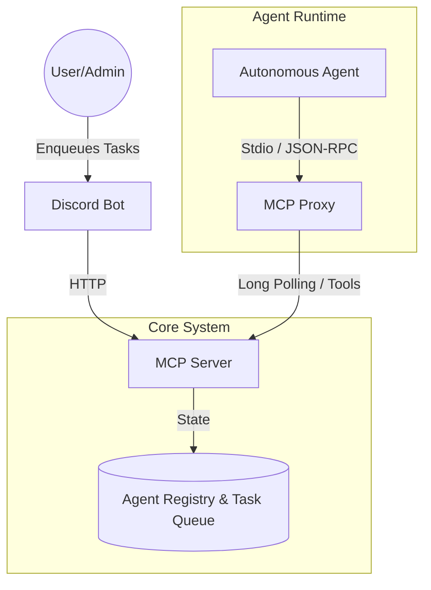

# WAAAH: Web-Age Autonomous Agent Hub

WAAAH is a system for orchestrating autonomous AI agents to collaborate on complex software engineering tasks. It utilizes the Model Context Protocol (MCP) to establish a communication layer between an orchestration server, a proxy, and various client interfaces (CLI, Discord, VS Code).


## 🚀 Architecture



## 📦 Packages

This is a monorepo managed with `pnpm workspaces`.

- **[`packages/mcp-server`](packages/mcp-server)**: The central orchestration server. Handles agent registration, task queuing, and communication.
- **[`packages/mcp-proxy`](packages/mcp-proxy)**: A bridge that runs locally with the agent, exposing MCP tools via `stdio` and communicating with the server via HTTP.
- **[`packages/bot`](packages/bot)**: Unified Discord/Slack bot for task submission and monitoring.
- **[`packages/types`](packages/types)**: Shared TypeScript definitions and Zod schemas.

## ⚡ WAAAH vs Single-Agent AI

| Feature | WAAAH | Single Agent (e.g., Antigravity) |
|---------|-------|----------------------------------|
| **Agents** | Multiple specialized agents | One agent per session |
| **Delegation** | PM → FullStack → TestEng | N/A |
| **Persistence** | SQLite (tasks, agents, heartbeats) | Conversation only |
| **Integration** | Discord, Slack, CLI | Direct IDE |
| **Remote Control** | Yes (chat bots → HTTP) | Local only |

**Use WAAAH when:** You need a squad of agents collaborating on larger projects.
**Use single agent when:** Interactive pair programming in your IDE.

## 🛠️ Prerequisites

- **Node.js**: v18+
- **PNPM**: All dependencies are managed via pnpm.

## 🏃 Quick Start

1.  **Install & Build**
    ```bash
    pnpm install && pnpm build
    ```

2.  **Start the Server**
    ```bash
    pnpm server
    ```

3.  **Send a Task via CLI**
    ```bash
    pnpm cli send fullstack-1 "Create a login page"
    pnpm cli list-agents
    ```

## ⚙️ Configuration

1.  Copy the example environment file:
    ```bash
    cp .env.example .env
    ```
2.  Generate an API key:
    ```bash
    openssl rand -hex 32
    ```
3.  Edit `.env` to set your tokens:
    - **`WAAAH_API_KEY`**: Shared secret for server authentication (required for production).
    - **`DISCORD_TOKEN`**: Required for the Discord bot.
    - **`APPROVED_USERS`**: Restrict bot access to specific Discord user IDs.
    - **`DOMAIN_NAME`**: Required for Docker/SSL production setup.

---

## 🚀 Production Deployment (Docker + SSL)

To deploy WAAAH with a persistent database, Nginx reverse proxy, and Let's Encrypt SSL:

1.  **Configure Environment**:
    Make sure `.env` is set up with your `DOMAIN_NAME` and `DISCORD_TOKEN`.

2.  **Initialize SSL Certificates**:
    Run the helper script to generate Let's Encrypt certificates (requires Docker).
    ```bash
    chmod +x init-letsencrypt.sh
    ./init-letsencrypt.sh
    ```

3.  **Start Services**:
    ```bash
    docker compose up -d --build
    ```
    - Server: `https://yourdomain.com`
    - Database: Persisted in `./data`

---

## 🤖 MCP Integration

WAAAH works with any AI system supporting the Model Context Protocol (MCP).

**[📖 Full MCP Integration Guide](docs/MCP_INTEGRATION.md)** - Covers:
- Antigravity (VS Code)
- Claude Desktop
- Cursor / Windsurf
- OpenAI Agents SDK
- Chainlit / Cherry Studio

### Quick Setup (Antigravity)

Add to `~/.gemini/settings.json`:

```json
{
  "mcpServers": {
    "waaah": {
      "command": "node",
      "args": ["/path/to/WAAAH/packages/mcp-proxy/dist/index.js"],
      "env": {
        "WAAAH_SERVER_URL": "https://yourdomain.com",
        "AGENT_ID": "fullstack-1",
        "AGENT_ROLE": "full-stack-engineer",
        "WAAAH_API_KEY": "your_api_key"
      }
    }
  }
}
```

### Step 2: Initialize Agent

In Antigravity, use one of these workflows:

| Command | Role |
|---------|------|
| `/waaah-fullstack` | Full Stack Engineer |
| `/waaah-pm` | Project Manager |
| `/waaah-testeng` | Test Engineer |

This loads the system prompt and starts the autonomous agent loop.

### Step 3: Send Tasks

From another terminal:
```bash
pnpm cli send fullstack-1 "Implement user authentication"
```

The agent will receive the task via `wait_for_prompt` and execute autonomously.

---

## 📦 Available Scripts

| Script | Description |
|--------|-------------|
| `pnpm server` | Start MCP orchestration server (Local) |
| `pnpm cli <command>` | CLI for local testing |
| `pnpm bot` | Start Discord bot |
| `docker compose up` | Start full stack (Server + Nginx + DB) |
| `./init-letsencrypt.sh` | Initialize SSL certificates for Docker |
| `pnpm proxy` | Start MCP proxy instance |
| `pnpm build` | Build all packages |

---

## 📂 Packages

- **[`packages/mcp-server`](packages/mcp-server)**: Central orchestration server
- **[`packages/mcp-proxy`](packages/mcp-proxy)**: Stdio↔HTTP bridge for agents
- **[`packages/cli`](packages/cli)**: Command-line interface
- **[`packages/discord-bot`](packages/discord-bot)**: Discord integration
- **[`packages/types`](packages/types)**: Shared TypeScript definitions

## 🤝 Contributing

See [CONTRIBUTING.md](./CONTRIBUTING.md) for guidelines.

## 📄 License

MIT

