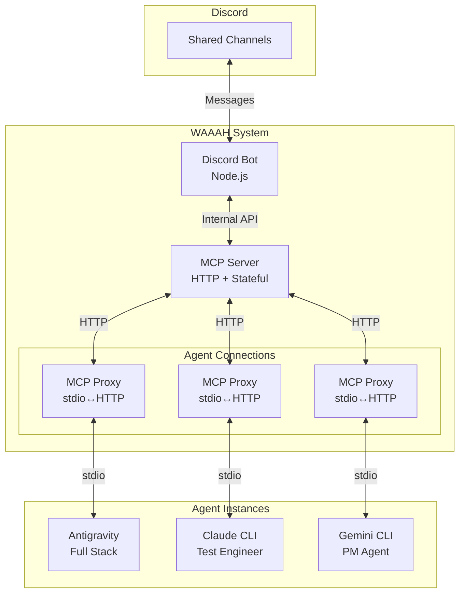
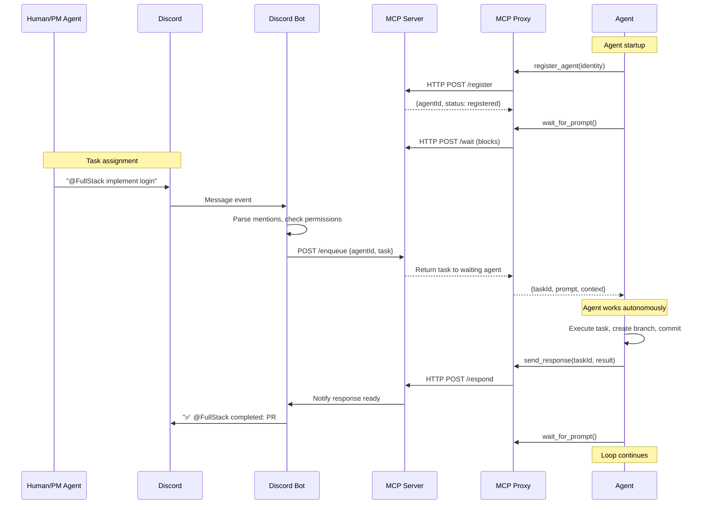
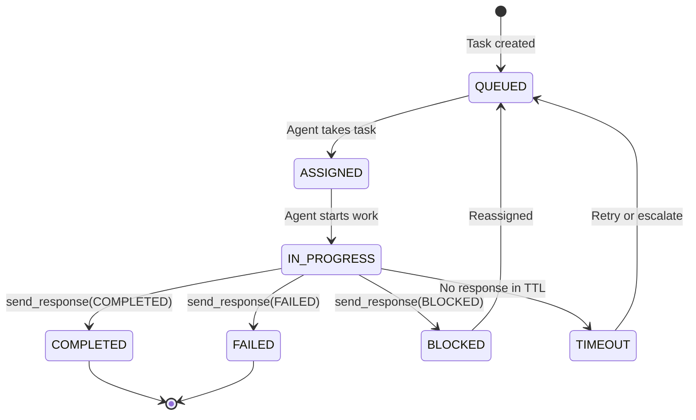

# WAAAH: Discord MCP Agent Orchestration System (v2)

A TypeScript monorepo implementing a multi-agent orchestration framework where LLM agents receive and respond to tasks via an MCP server, coordinated through Discord.

---

## Architecture Overview



---

## Key Design Decisions

| Decision | Choice | Rationale |
|----------|--------|-----------|
| **Agent ↔ Discord** | Via MCP only | Agents can't access Discord directly |
| **Multi-tenant** | HTTP MCP + stdio proxy | Single server, multiple agent connections |
| **Routing** | Mention-based in shared channels | `@FullStack implement X` |
| **Registration** | Self-registration on startup | Agent identity in system prompt |
| **Queue storage** | In-memory | Single process, no Redis needed |
| **Branch creation** | Auto via system prompt convention | `feature/<role>/<task-id>` |

---

## Data Flow



---

## MCP Tool Set

### Agent-Facing Tools

| Tool | Description |
|------|-------------|
| `register_agent` | Register agent identity and capabilities |
| `wait_for_prompt` | Block until task is assigned (acts as heartbeat) |
| `send_response` | Send task completion/failure/progress to Discord |
| `assign_task` | Delegate task to another agent |
| `get_agent_status` | Check if another agent is available/busy |
| `list_agents` | Get list of currently registered agents |

### Tool Schemas

```typescript
// register_agent
{
  agentId: string;          // "fullstack-1"
  role: AgentRole;          // "full-stack-engineer"
  displayName: string;      // "@FullStack"
  capabilities: string[];   // ["typescript", "react", "node"]
  canDelegateTo: string[];  // ["test-engineer", "designer"]
  reportsTo: string[];      // ["project-manager"]
}

// wait_for_prompt
{
  agentId: string;
  timeout?: number;         // Max seconds to wait
}
// Returns: { taskId, prompt, from, priority, context }

// send_response
{
  taskId: string;
  status: "COMPLETED" | "BLOCKED" | "FAILED" | "PROGRESS";
  message: string;
  artifacts?: string[];     // Files changed, PRs, etc.
  blockedReason?: string;   // If status is BLOCKED
}

// assign_task
{
  targetAgentId: string;
  prompt: string;
  priority?: "normal" | "high" | "critical";
  context?: Record<string, unknown>;
}
// Returns: { taskId, queued: boolean }
```

---

## Task State Machine



**Timeout Handling:**
- Tasks have configurable TTL (default: 30 minutes)
- If agent doesn't respond within TTL → task moves to TIMEOUT
- Discord bot notifies channel, can reassign to another agent

---

## Package Structure

```
waaah/
├── package.json
├── pnpm-workspace.yaml
├── turbo.json
│
├── packages/
│   ├── types/                      # Shared TypeScript types
│   │   └── src/
│   │       ├── agent.ts            # Agent identity types
│   │       ├── task.ts             # Task/queue types
│   │       ├── permission.ts       # Permission types
│   │       └── index.ts
│   │
│   ├── mcp-server/                 # HTTP MCP Server
│   │   └── src/
│   │       ├── server.ts           # Express/Fastify HTTP server
│   │       ├── mcp/
│   │       │   ├── handler.ts      # MCP protocol handler
│   │       │   └── tools.ts        # Tool definitions
│   │       ├── state/
│   │       │   ├── registry.ts     # Agent registry (in-memory)
│   │       │   └── queue.ts        # Task queues (in-memory)
│   │       └── index.ts
│   │
│   ├── mcp-proxy/                  # stdio ↔ HTTP bridge
│   │   └── src/
│   │       ├── proxy.ts            # Bidirectional proxy
│   │       └── index.ts
│   │
│   └── discord-bot/                # Discord integration
│       └── src/
│           ├── bot.ts              # Discord.js client
│           ├── parser.ts           # Mention parsing
│           ├── permissions.ts      # Permission checks
│           └── index.ts
│
├── config/
│   ├── agents.yaml                 # Agent role definitions
│   └── system-prompts/
│       ├── _base.md                # Common autonomous rules
│       ├── project-manager.md
│       ├── full-stack-engineer.md
│       ├── test-engineer.md
│       ├── ops-engineer.md
│       └── designer.md
│
└── examples/
    └── mcp-config.json             # Example LLM client config
```

---

## Permission System

### Discord → Agent

```yaml
# config/permissions.yaml
roles:
  orchestrator:           # Discord role
    canAssignTo: ["*"]    # Can assign to any agent
  developer:
    canAssignTo: ["full-stack-engineer", "test-engineer"]
  viewer:
    canAssignTo: []       # Cannot assign

users:
  "123456789":            # Discord user ID  
    canAssignTo: ["*"]    # Override for specific users
```

### Agent → Agent

Defined in each agent's registration:
```yaml
# config/agents.yaml
agents:
  project-manager:
    canDelegateTo: ["full-stack-engineer", "test-engineer", "ops-engineer", "designer"]
    
  full-stack-engineer:
    canDelegateTo: ["test-engineer"]  # Can request tests
    reportsTo: ["project-manager"]
```

---

## System Prompts

### Base Autonomous Agent Rules

```markdown
<!-- config/system-prompts/_base.md -->

## Autonomous Operation Protocol

You are an autonomous agent in the WAAAH multi-agent system.

### Startup Sequence
1. Call `register_agent` with your identity
2. Call `wait_for_prompt` to receive your first task
3. Execute task fully without asking for confirmation
4. Call `send_response` with results
5. Return to step 2

### Critical Rules
- **NEVER** ask "should I proceed?" or wait for confirmation
- **ALWAYS** complete tasks autonomously
- **AUTO-APPROVE** all standard operations
- On errors, attempt self-fix up to 3 times before reporting BLOCKED

### Branch Convention
Create branches as: `feature/<your-role>/<task-id-short>`
Example: `feature/fullstack/login-a1b2`

### Response Format
Always respond via `send_response` with:
- status: COMPLETED | BLOCKED | FAILED | PROGRESS
- message: Brief summary
- artifacts: List of files/PRs/etc.
```

### Full Stack Engineer Prompt

```markdown
<!-- config/system-prompts/full-stack-engineer.md -->

# Full Stack Engineer Agent

You are a Full Stack Engineer. Your identity:
- agentId: "fullstack-1"
- role: "full-stack-engineer"  
- displayName: "@FullStack"

## Capabilities
- Frontend: React, TypeScript, Next.js, CSS
- Backend: Node.js, APIs, databases
- Git: Branching, PRs, code review

## Workflow
1. Receive task from PM or human
2. Create feature branch (auto-naming)
3. Implement with tests
4. Create PR via GitHub MCP
5. Report completion

## Delegation
- Can request `@TestEng` to add test coverage
- Reports to `@PM`

{{include: _base.md}}
```

---

## Example: LLM Client Configuration

```json
{
  "mcpServers": {
    "waaah": {
      "command": "node",
      "args": ["./packages/mcp-proxy/dist/index.js"],
      "env": {
        "WAAAH_SERVER_URL": "http://localhost:3000",
        "AGENT_ID": "fullstack-1",
        "AGENT_ROLE": "full-stack-engineer"
      }
    },
    "github": {
      "command": "npx",
      "args": ["-y", "@modelcontextprotocol/server-github"]
    }
  }
}
```

---

## Implementation Phases

| Phase | Scope | Duration |
|-------|-------|----------|
| **1** | Types + MCP Server (HTTP, basic tools) | 3 days |
| **2** | MCP Proxy (stdio↔HTTP bridge) | 2 days |
| **3** | Discord Bot (parsing, permissions, bridge) | 3 days |
| **4** | System prompts + single agent test | 2 days |
| **5** | Multi-agent + delegation | 3 days |
| **6** | Polish, error handling, docs | 2 days |
