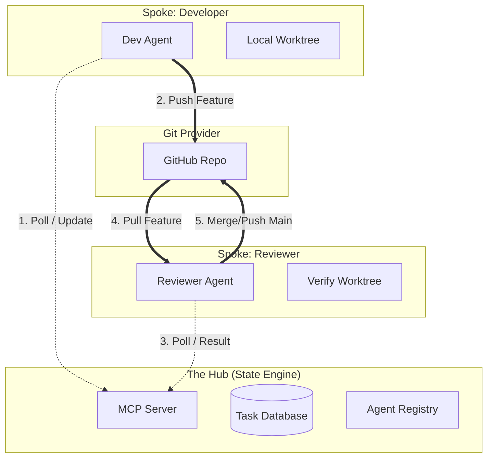

# WAAAH Master Architecture Document (V5 - Pure Hub)

> [!IMPORTANT]
> **Status**: APPROVED V5
> **Model**: Pure Hub (State & Coordination Only)
> **Constraint**: Server never touches Git/Files.

## 1. Core Assumptions
The system design relies on the following invariants:
1.  **Git is the Source of Truth**: The Server only knows about `Task IDs` and `Commit SHAs`. It never stores Code.
2.  **Agent Autonomy**: Agents manage their own disk/environment. The Server cannot "fix" a broken Agent.
3.  **Reviewer Liveness**: For every Workspace Context (e.g., TeaProtocol), there MUST be at least one active Agent with `role: reviewer` (or a dual-role Dev). If no Reviewer exists, tasks will stall in `IN_REVIEW`.
4.  **Trust Boundary**: The Server trusts Agents to report their `workspaceContext` truthfully. See [Agent Context Spec](./agent_capabilities_and_context_spec.md).
5.  **Connectivity**: All Agents have independent access to the Git Provider (GitHub).

---

## 2. System Topology

---

## 3. Executive Summary
The WAAAH Server is a **State Machine**. It tracks the lifecycle of a Task (`QUEUED` -> `ASSIGNED` -> `IN_REVIEW` -> `COMPLETED`) but performs **none** of the work.
*   **Developers** write code.
*   **Reviewers** verify code.
*   **Server** connects them.

---

## 4. Workflows

### 4.1 Dispatch & Branching
1.  **Registration**: Agent sends `register_agent(..., workspaceContext: { uri: "..." })`.
2.  **Assignment**: Scheduler (Locked) finds Agent matching Context.
3.  **Handshake**: Agent calls `ack_task(T1)`. Server generates and returns `branchName: "feature/T1"`.

### 4.2 The Developer Loop
1.  **Setup**: Dev Agent creates local worktree `feature/T1`.
2.  **Work**: Dev loops on code/test locally.
3.  **Push**: Dev pushes `feature/T1` to GitHub.
4.  **Handoff**: Dev calls `send_response(status='IN_REVIEW', metadata={commit: 'sha...'})`.

### 4.3 The Review Loop
1.  **Trigger**: Server updates T1 to `IN_REVIEW`.
2.  **Pickup**: Reviewer Agent polls `list_tasks(status='IN_REVIEW')`.
3.  **Verify**:
    *   Reviewer pulls `feature/T1`.
    *   Reviewer runs `npm test` (or equivalent).
4.  **Outcome**:
    *   **Pass**: Reviewer merges to main, pushes, calls `send_response(status='COMPLETED')`.
    *   **Conflict**: Reviewer calls `send_response(status='BLOCKED', reason='Merge Conflict')`.
    *   **Fail**: Reviewer calls `send_response(status='IN_PROGRESS', reason='Tests Failed')`.

---

## 5. System Resilience (The Watchdog)
Since the Server is passive, it needs a **Watchdog** to prevent stalls.
*   **Stall Detection**: If a Task remains `IN_REVIEW` for >30 minutes (configurable), the Server flags it.
*   **Action**: Server can reset status to `QUEUED` (to find another Reviewer) or `BLOCKED` (alerting human).

---

## 6. Implementation Checklist

### Phase 1: Protocol & Schemas
- [x] **Schema**: Add `workspaceContext` to `register_agent`.
- [x] **Schema**: Remove `create_worktree` (Legacy/Local responsibility).
- [x] **Schema**: Add `branchName` to `Task` model.

### Phase 2: Server Core (State Only)
- [x] **Registry**: Index agents by Context.
- [x] **Tools**: Update `ack_task` (Generate Branch Name).
- [x] **Queue**: Implement Mutex Locking.
- [x] **Cleanup**: Delete all Git/Exec code.

### Phase 3: Agent Logic (Client Side)
- [x] **Client**: Implement "Local Worktree Manager" (Git Wrapper).
- [x] **Client**: Implement "Reviewer Logic" (Fetch/Test/Merge).
