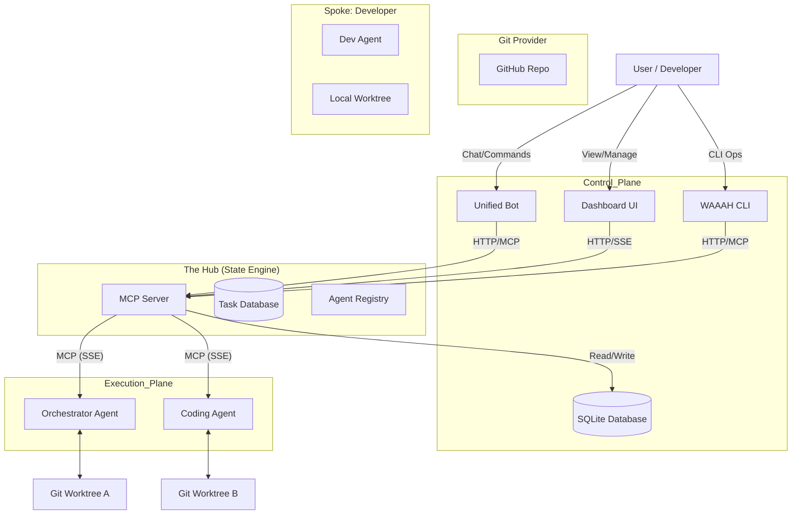
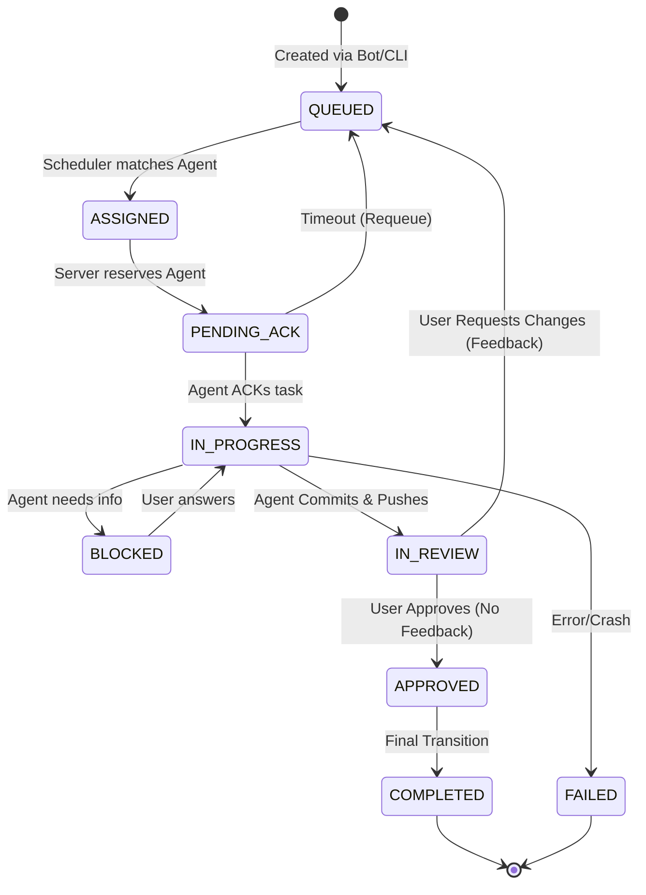

# WAAAH Master Architecture Document (V5 - Pure Hub)

> [!IMPORTANT]
> **Status**: APPROVED V5
> **Model**: Pure Hub (State & Coordination Only)
> **Constraint**: Server never touches Git/Files.

## 1. Core Assumptions
The system design relies on the following invariants:
1.  **Git is the Source of Truth**: The Server only knows about `Task IDs` and `Commit SHAs`. It never stores Code.
2.  **Agent Autonomy**: Agents manage their own disk/environment. The Server cannot "fix" a broken Agent.
3.  **Reviewer Liveness**: For every Workspace Context (e.g., TeaProtocol), there MUST be at least one active Agent with `role: reviewer` (or a dual-role Dev). If no Reviewer exists, tasks will stall in `IN_REVIEW`.
4.  **Trust Boundary**: The Server trusts Agents to report their `workspaceContext` truthfully. See [Agent Context Spec](./agent_capabilities_and_context_spec.md).
5.  **Connectivity**: All Agents have independent access to the Git Provider (GitHub).

---

## 2. System Topology

### Components Detail

1.  **MCP Server (`packages/mcp-server`)**:
    *   **Role**: Scheduling, communications, data persistence, and task state management.
    *   **Constraint**: NO access to agent's remote contexts or file systems.
    *   Hosts MCP endpoints and Admin API.
    *   Runs the `HybridScheduler` (periodic cleanup/rebalancing loop).

2.  **Unified Bot (`packages/bot`)**:
    *   Interface for users on Discord and Slack.
    *   Adapters normalize messages into a standard format.

3.  **Dashboard (`packages/mcp-server/client`)**:
    *   React/Vite app visualization of the Kanban board.
    *   Real-time updates via Server-Sent Events.

4.  **CLI (`packages/cli`)**:
    *   Operator tool for manual management (`waaah send`, `waaah status`).
    *   Used for headless operations.

5.  **Agents**:
    *   Autonomous processes connecting via MCP.
    *   **Responsibility**:
        *   Poll for work (`wait_for_prompt`).
        *   **Worktree Management**: Create/Manage isolated git worktrees for tasks.
        *   **Execution**: Perform changes, commit, and push.

---

## 3. Core Workflows

### 3.1 Task Lifecycle

Tasks move through a strict state machine. The "Happy Path" involves a review loop.

**Key Transitions**:
*   **IN_PROGRESS → IN_REVIEW**: Agent has committed changes to a feature branch and pushed to origin.
*   **IN_REVIEW → QUEUED**: User provides feedback/comments. Status resets to allow Agent to pick it up again (or a different agent).
*   **IN_REVIEW → APPROVED**: User is satisfied. No further changes needed.
*   **APPROVED → COMPLETED**: System finalizes the task.

### 3.2 Task Assignment & Scheduler

The `HybridScheduler` runs frequently (every ~2s) to process the queue.

**Assignment Logic**:
Tasks are **pulled** by agents via `wait_for_prompt`. The server's scheduler acts as a matchmaker to "reserve" a task for a specific polling request.

1.  **Orphan/Timeout Check**: Requeue `PENDING_ACK` tasks > 30s.
2.  **Unblock**: Move `BLOCKED` tasks to `QUEUED` if dependencies are resolved.
3.  **Match & Reserve**:
    *   Trigger: Agent polls `wait_for_prompt`.
    *   Logic:
        *   **Capabilities**: Must match `requiredCapabilities`.
        *   **Workspace Context**: `repoId` matches Agent's current context (to reuse worktrees).
        *   **Agent Hint**: Preference for specific agent IDs.
    *   Action: Task state `QUEUED` → `ASSIGNED` → `PENDING_ACK`.

---

## 4. State Management & Data

### Database Schema
We use SQLite (`mcp.db`) as the single source for all state.

### Key Assumptions
1.  **Agent Volatility**: Agents may crash. `ACK_TIMEOUT` handles this.
2.  **Environment Specificity**: The file system is **NOT** generic. We assume unique environments.
    *   Agents must report their `workspaceContext` (Repo ID, Branch, Local/Github).
    *   `assign_task` specifies the target environment.
3.  **Git Worktree Mandate**:
    *   Agents MUST use `git worktree` for isolation.
    *   Flow: `create_worktree` (Standardized branch name) → Do Work → Commit → Push.
    *   Main branch should remain clean.
4.  **No Server Access to FS**: The MCP Server knows *about* the file system (via metadata) but cannot touch it directly.

---

## 5. Reverse Engineering Notes

*   **Scheduler**: Originally "Hybrid" (Push/Pull), now strictly a helper for the Pull-based `wait_for_prompt` mechanism.
*   **Worktree Tooling**: Need to implement/standardize `create_worktree` MCP tool with enforced branch naming conventions.
