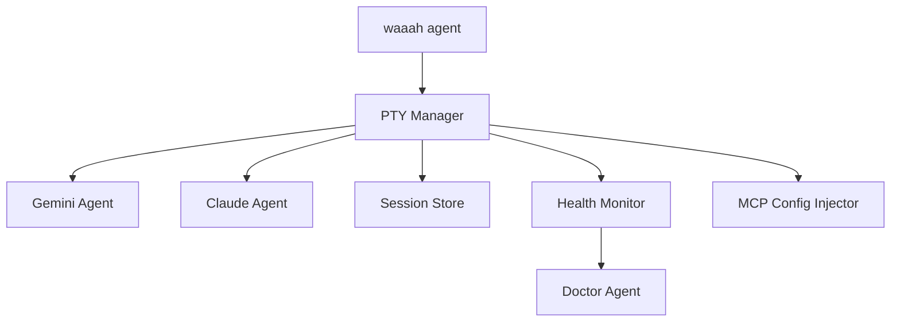

# @opensourcewtf/waaah-cli-wrapper

CLI wrapper for spawning and managing external coding agents (Gemini, Claude) with WAAAH integration.

## Installation

```bash
npm install -g @opensourcewtf/waaah-cli-wrapper
```

## Usage

```bash
# Start a Gemini agent as orchestrator
waaah agent --start gemini --as waaah-orc

# Start a Claude agent
waaah agent --start claude
```

## Features

- **PTY Management**: Native terminal control via `node-pty`
- **Session Persistence**: Resume agents across restarts
- **MCP Auto-Injection**: Automatic waaah-proxy configuration
- **Loop Detection**: Circuit breaker for runaway agents
- **Workflow Injection**: Auto-inject `/waaah-*` workflows

## Architecture



## Modules

| Module | Description |
|--------|-------------|
| `agents/` | Agent spawners (Gemini, Claude) |
| `config/` | MCP configuration management |
| `doctor/` | Code health monitoring daemon |
| `monitor/` | Agent health and heartbeat tracking |
| `pty/` | PTY wrapper for native terminal |
| `session/` | Session persistence (`.waaah/sessions/`) |
| `workflow/` | Workflow injection logic |

## Environment Variables

| Variable | Default | Description |
|----------|---------|-------------|
| `WAAAH_SERVER_URL` | `http://localhost:3000` | Server URL |
| `WAAAH_API_KEY` | (none) | API key for auth |

## Development

```bash
pnpm build
pnpm test
```
