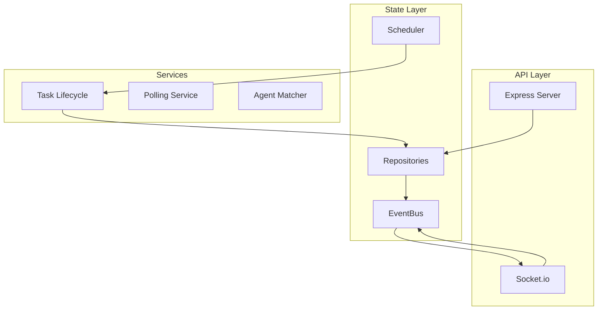

# @opensourcewtf/waaah-mcp-server

The core orchestration engine for the WAAAH system. Manages agent registration, task queuing, real-time updates, and tool execution.

## Features

- **Agent Registry**: SQLite-backed tracking of agents, capabilities, and heartbeats
- **Task Queue**: Priority-based queue with capability-aware scheduling
- **Real-time Updates**: WebSocket (Socket.io) for instant UI sync
- **Admin Dashboard**: Embedded React UI at `/admin`
- **MCP Tools**: Standard WAAAH toolset via JSON-RPC
- **API Key Auth**: Optional authentication via `WAAAH_API_KEY`

## Architecture



## Environment Variables

| Variable | Default | Description |
|----------|---------|-------------|
| `PORT` | `3000` | Server listen port |
| `WAAAH_API_KEY` | (none) | Shared secret for API auth |
| `DB_PATH` | `./data/waaah.db` | SQLite database path |
| `AGENTS_CONFIG` | `./config/agents.yaml` | Agent seed configuration |

## MCP Tools

| Tool | Description |
|------|-------------|
| `register_agent` | Register identity and capabilities |
| `wait_for_prompt` | Long-poll for new tasks (blocking) |
| `send_response` | Submit task results/status |
| `assign_task` | Delegate tasks to peers |
| `update_progress` | Report task progress |
| `block_task` | Mark task as blocked |
| `list_agents` | Discover available agents |
| `get_agent_status` | Check peer availability |

## Admin API

| Endpoint | Method | Description |
|----------|--------|-------------|
| `/admin/tasks` | GET | List all tasks |
| `/admin/agents` | GET | List all agents |
| `/admin/enqueue` | POST | Create new task |
| `/admin/tasks/:id/cancel` | POST | Cancel a task |
| `/health` | GET | Health check |

## WebSocket Events

| Event | Direction | Description |
|-------|-----------|-------------|
| `sync:full` | Server→Client | Initial state sync |
| `task:created` | Server→Client | New task queued |
| `task:updated` | Server→Client | Task status changed |
| `agent:updated` | Server→Client | Agent state changed |

## Development

```bash
pnpm build
pnpm test
node dist/server.js
```

## Docker

```bash
docker compose up waaah-server
```
