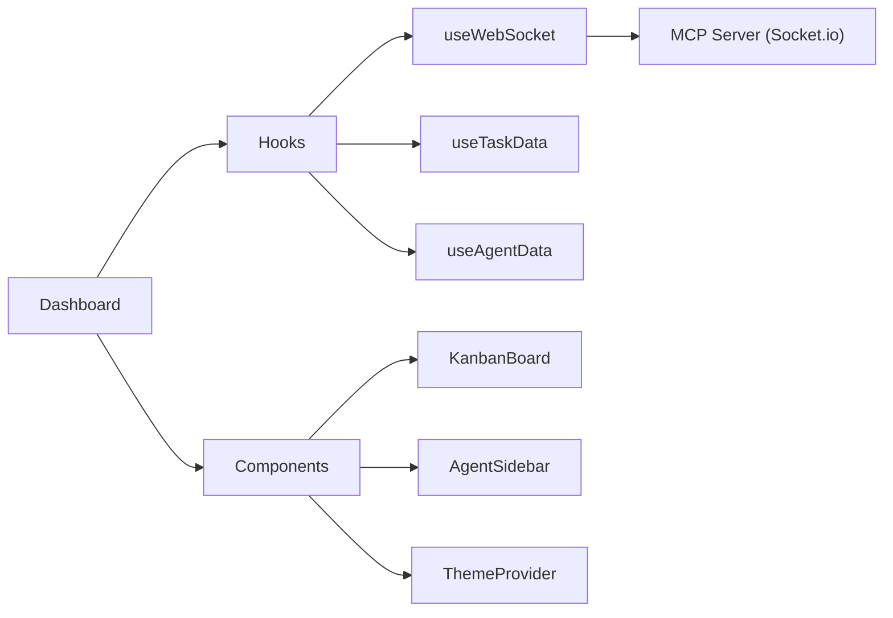

# Mission Command Dashboard

Real-time web UI for monitoring and managing the WAAAH agent ecosystem.

## Features

- **Kanban Board**: Drag-free task visualization by status (Queued → Assigned → In Progress → In Review → Completed)
- **Agent Sidebar**: Color-coded status indicators for each connected agent
- **Task Details**: Expandable cards with prompt, context, and agent response
- **Real-time Updates**: WebSocket-powered live state sync
- **Theme Engine**: WAAAH (green), Light, and Dark themes

## Architecture



## Development

```bash
# From packages/mcp-server/client
pnpm dev    # Start Vite dev server (proxied via MCP server)
pnpm build  # Build for production
pnpm lint   # Run ESLint
```

## Key Components

| Component | Description |
|-----------|-------------|
| `Dashboard` | Main layout with board and sidebar |
| `KanbanBoard` | Task columns with expandable cards |
| `AgentSidebar` | Collapsed indicator bar (Discord-style) |
| `ThemeProvider` | CSS variable injection for theming |

## API Integration

The client uses the parent MCP server's API:

| Endpoint | Method | Description |
|----------|--------|-------------|
| `/admin/tasks` | GET | Fetch all tasks |
| `/admin/agents` | GET | Fetch all agents |
| `/admin/enqueue` | POST | Create new task |
| WebSocket `sync:full` | — | Initial state sync |
| WebSocket `task:*` | — | Real-time task updates |

## Environment

The client runs embedded within the MCP server at `/admin`. In dev mode, Vite proxies API calls to the server.
